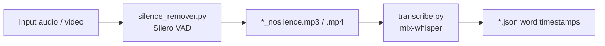
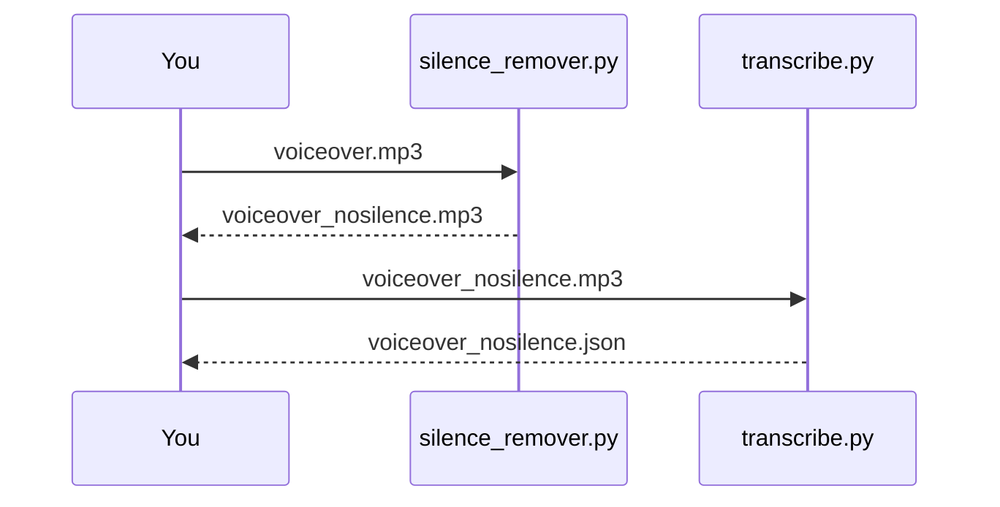

# silence-remover

Local toolkit for tightening social-media voiceovers and producing **word-level** transcripts.

1. **`silence_remover.py`** — detect speech with [Silero VAD](https://github.com/snakers4/silero-vad), drop pauses (jump-cut), export tighter audio/video via `ffmpeg`
2. **`transcribe.py`** — transcribe the result with [mlx-whisper](https://github.com/ml-explore/mlx-examples/tree/main/whisper) into JSON with per-word timestamps



---

## Requirements

| Dependency | Notes |
|------------|--------|
| **macOS Apple Silicon** | Required for `mlx-whisper` (Neural Engine / MLX) |
| **Python 3.11+** | 3.11 recommended for MLX wheels |
| **ffmpeg / ffprobe** | Must be on `PATH` (`brew install ffmpeg`) |
| **Network (first run)** | Downloads Silero VAD + Whisper model weights |

---

## Setup

```bash
cd silence-remover

# Prefer Python 3.11 on Apple Silicon
python3.11 -m venv .venv
source .venv/bin/activate

pip install -U pip
pip install -r requirements.txt
```

`requirements.txt` installs:

- `silero-vad`, `torch`, `numpy` — silence removal
- `mlx-whisper` — word-level transcription

---

## Quick start (full pipeline)

```bash
source .venv/bin/activate

# 1) Remove silences → tighter voiceover
python silence_remover.py voiceover.mp3 -o voiceover_nosilence.mp3

# 2) Word-level JSON transcript (aligned to the nosilence audio)
python transcribe.py voiceover_nosilence.mp3 -o voiceover_nosilence.json
```

Typical result on a ~125s voiceover: ~94s audio + JSON with ~200+ words and `start` / `end` per word.

---

## 1. Silence remover

### What it does

1. Extracts mono 16 kHz WAV from the input (`ffmpeg`)
2. Runs **Silero VAD** to find speech segments
3. Keeps speech and drops gaps longer than `--max-silence` (default `0` = pure jump-cut)
4. Concatenates keep-windows with `ffmpeg` and writes the output

Works on **audio** (`.mp3`, `.wav`, `.m4a`, …) and **video** (`.mp4`, `.mov`, …). For video, both A/V are cut and re-joined.

### Usage

```bash
python silence_remover.py <input> [-o OUTPUT] [options]
```

#### Examples

```bash
# Default jump-cut (shortest / fastest voiceover)
python silence_remover.py voiceover.mp3

# Explicit output path
python silence_remover.py voiceover.mp3 -o out/tight.mp3

# Video
python silence_remover.py take.mp4 -o take_nosilence.mp4

# Softer pacing: keep up to 150 ms between phrases
python silence_remover.py voiceover.mp3 --max-silence 0.15 --speech-pad-ms 40 --threshold 0.5

# Print detected keep windows as JSON to stdout
python silence_remover.py voiceover.mp3 --json
```

Default output name: `<stem>_nosilence.<ext>` (e.g. `voiceover_nosilence.mp3`).

### CLI options

| Option | Default | Description |
|--------|---------|-------------|
| `-o`, `--output` | `<stem>_nosilence.<ext>` | Output file path |
| `--max-silence` | `0.0` | Max silence kept between speech segments (seconds). `0` = concatenate speech only |
| `--threshold` | `0.65` | Silero speech probability threshold (higher = less “speech”, shorter output) |
| `--min-speech-ms` | `200` | Ignore speech shorter than this (ms) |
| `--min-silence-ms` | `50` | Min silence to split speech (ms). Lower = more pauses removed |
| `--speech-pad-ms` | `0` | Padding around speech edges (ms). Raise if word starts/ends clip |
| `--json` | off | Print speech / keep segment timestamps to stdout |

### Tuning guide

| Goal | Suggested flags |
|------|-----------------|
| Fastest social cut (default) | `--max-silence 0 --speech-pad-ms 0 --threshold 0.65` |
| Avoid clipped words | `--speech-pad-ms 20` (or `30`) |
| More natural pauses | `--max-silence 0.15 --speech-pad-ms 40 --threshold 0.5` |
| Even shorter than default | `--threshold 0.7 --min-speech-ms 250` |

---

## 2. Transcribe (word-level JSON)

### What it does

Runs **mlx-whisper** (`whisper-large-v3-mlx` by default) with **word timestamps** and writes a Whisper-style JSON file.

Timestamps match the **input audio you pass in**. Always transcribe the **nosilence** file if you want times aligned to the tightened voiceover.

### Usage

```bash
python transcribe.py <audio> [-o OUTPUT.json] [options]
```

#### Examples

```bash
# Default: Turkish, word timestamps, output next to input
python transcribe.py voiceover_nosilence.mp3

# Explicit path + language
python transcribe.py voiceover_nosilence.mp3 -o captions.json --language en

# Quiet mode (less console spam)
python transcribe.py voiceover_nosilence.mp3 -q

# Segments only (no per-word times)
python transcribe.py voiceover_nosilence.mp3 --no-word-timestamps
```

Default output name: `<stem>.json`.

### CLI options

| Option | Default | Description |
|--------|---------|-------------|
| `-o`, `--output` | `<stem>.json` | Output JSON path |
| `--language` | `tr` | Whisper language code (`tr`, `en`, …) |
| `--model` | `mlx-community/whisper-large-v3-mlx` | Hugging Face / MLX model id |
| `--no-word-timestamps` | off | Segment-level only |
| `-q`, `--quiet` | off | Suppress progress text |

### JSON shape

Top-level keys: `text`, `segments`, `language`.

Each segment may include a `words` array:

```json
{
  "text": " Belki de yıllardır yanlış çayı içiyorsun. ...",
  "language": "tr",
  "segments": [
    {
      "id": 0,
      "start": 0.0,
      "end": 1.92,
      "text": " Belki de yıllardır yanlış çayı içiyorsun.",
      "words": [
        { "word": " Belki", "start": 0.0, "end": 0.12, "probability": 0.95 },
        { "word": " de", "start": 0.12, "end": 0.24, "probability": 0.99 }
      ]
    }
  ]
}
```

Use `words[].start` / `words[].end` (seconds) for captions, karaoke overlays, or Remotion / CapCut-style edits.

---

## Recommended workflow

```bash
source .venv/bin/activate

# Tighten
python silence_remover.py raw/vo.mp3 -o out/vo_nosilence.mp3

# Transcribe the tightened file (timestamps match the short cut)
python transcribe.py out/vo_nosilence.mp3 -o out/vo_nosilence.json --language tr
```



---

## Project layout

```
silence-remover/
├── silence_remover.py   # Silero VAD + ffmpeg jump-cut
├── transcribe.py        # mlx-whisper → word-level JSON
├── requirements.txt
├── README.md
├── .gitignore
└── .venv/               # local virtualenv (not committed)
```

Media and generated files (`*.mp3`, `*.json`, `*_nosilence.*`, …) are gitignored by default.

---

## Troubleshooting

| Problem | Fix |
|---------|-----|
| `ffmpeg` / `ffprobe` not found | `brew install ffmpeg` |
| `mlx-whisper` import error | Use Apple Silicon + Python 3.11 venv; `pip install mlx-whisper` |
| Words sound clipped after silence removal | Raise `--speech-pad-ms` (e.g. `20`–`40`) |
| Output still too long | Raise `--threshold` (e.g. `0.7`) or lower `--min-silence-ms` |
| Output too aggressive / choppy | `--max-silence 0.15 --speech-pad-ms 40 --threshold 0.5` |
| Transcript times don’t match final edit | Transcribe the **nosilence** file, not the original |
| First Whisper run is slow | Model download (~large-v3); later runs use cache |

---

## License

MIT — see [LICENSE](LICENSE).

Silero VAD and Whisper / mlx-whisper are third-party projects; respect their licenses and model terms. This repo is intended for offline, local processing of your own voiceovers.
