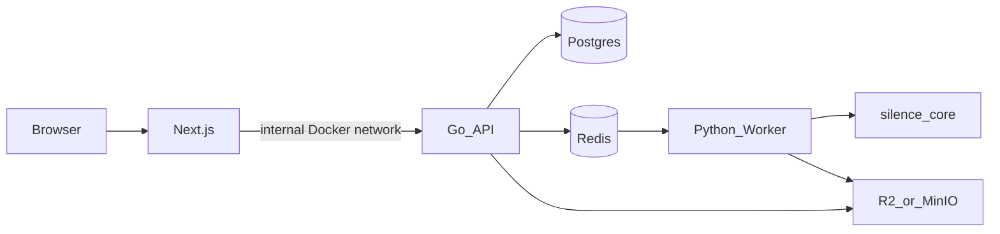

# silence-remover

Local toolkit **and** free web SaaS for tightening voiceovers with [Silero VAD](https://github.com/snakers4/silero-vad) + `ffmpeg`.



## What’s in the repo

| Path | Role |
|------|------|
| [`packages/silence_core/`](packages/silence_core/) | Importable silence-removal library |
| [`apps/cli/`](apps/cli/) | Local CLIs (`silence_remover.py`, `transcribe.py`) |
| [`apps/api/`](apps/api/) | Go REST API (jobs, rate limit, presign, queue) — **not public in MVP** |
| [`apps/worker/`](apps/worker/) | Python worker (Redis queue → silence_core → storage) |
| [`apps/web/`](apps/web/) | Free CutAir UI (no auth / no billing) |
| [`docker-compose.yml`](docker-compose.yml) | Dokploy-ready stack |
| [`docs/`](docs/) | Architecture, API, deploy guides |

## Documentation

| Doc | Contents |
|-----|----------|
| [docs/architecture.md](docs/architecture.md) | Monorepo layout, trust boundaries, job lifecycle |
| [docs/api.md](docs/api.md) | Internal Go `/v1` API, tokens, rate limits, queue |
| [docs/deploy.md](docs/deploy.md) | Dokploy + Compose, env vars, MinIO/R2 |

---

## Local CLI (silence remove)

### Requirements

- Python 3.10+
- `ffmpeg` / `ffprobe` on `PATH`
- Network on first run (Silero weights)

### Setup

```bash
python3 -m venv .venv
source .venv/bin/activate
pip install -e packages/silence_core
```

Full toolkit (includes mlx-whisper on Apple Silicon):

```bash
pip install -r requirements.txt
```

### Usage

```bash
python apps/cli/silence_remover.py voiceover.mp3 -o voiceover_nosilence.mp3
python apps/cli/silence_remover.py take.mp4 --max-silence 0.15 --speech-pad-ms 40

# Optional (macOS Apple Silicon / mlx-whisper only)
python apps/cli/transcribe.py voiceover_nosilence.mp3
```

See CLI flags via `python apps/cli/silence_remover.py -h`.

`apps/cli/transcribe.py` remains macOS / MLX-only and is **not** part of the SaaS stack.

---

## SaaS stack (Dokploy + Docker Compose)

MVP: **free**, no signup, **IP rate limits**, Go API reachable only from the web container.

### Services

- `web` — public (attach Dokploy domain + HTTPS here)
- `api` — internal only (do **not** publish a domain)
- `worker` — internal
- `postgres`, `redis` — internal
- `minio` — local/dev object storage (swap env for Cloudflare R2 in production)

### Configure

```bash
cp .env.example .env
# edit secrets / R2 credentials as needed
```

Important env vars:

| Variable | Purpose |
|----------|---------|
| `S3_ENDPOINT` | Server-side S3/R2/MinIO URL (`http://minio:9000` in Compose) |
| `S3_PUBLIC_ENDPOINT` | Browser-facing URL for presigned PUT/GET |
| `RATE_LIMIT_JOBS_PER_DAY` | Default `10` |
| `RATE_LIMIT_MAX_CONCURRENT` | Default `2` |
| `API_INTERNAL_URL` | Web → API (`http://api:8080`) |

### Run

```bash
docker compose up --build
```

Open `http://localhost:3000`.

### Dokploy

1. Create an application from this Git repo using Compose.
2. Set env from `.env.example` (prefer Cloudflare R2 in production).
3. Attach your domain **only** to the `web` service.
4. Leave `api` / `worker` / `postgres` / `redis` without public domains.
5. Set `S3_PUBLIC_ENDPOINT` to a URL the **browser** can reach (not `http://minio:9000`).

For R2, set both `S3_ENDPOINT` and `S3_PUBLIC_ENDPOINT` to your R2 S3 API URL. You can leave the Compose `minio` service unused or remove it later.

### Go API (internal)

| Method | Path | Notes |
|--------|------|-------|
| `POST` | `/v1/jobs` | Create job + presigned upload URL |
| `POST` | `/v1/jobs/{id}/complete-upload` | Verify upload + enqueue (`X-Job-Token`) |
| `GET` | `/v1/jobs/{id}` | Status / download URL (`X-Job-Token`) |
| `GET` | `/healthz` | Health |

Public API keys / external access are intentionally deferred.

---

## Project layout

```
silence-remover/
├── apps/
│   ├── api/          # Go
│   ├── cli/          # Local Python CLIs
│   ├── worker/       # Python worker
│   └── web/          # Next.js (CutAir)
├── packages/
│   └── silence_core/ # Shared processing library
├── docs/             # architecture, api, deploy
├── docker-compose.yml
├── .env.example
└── README.md
```

---

## Troubleshooting

| Problem | Fix |
|---------|-----|
| `ffmpeg` not found (CLI) | Install ffmpeg (`brew` / `apt`) |
| Upload fails with MinIO | Ensure port `9000` is reachable and `S3_PUBLIC_ENDPOINT` matches the browser host |
| Rate limit errors | Wait for the daily window or raise `RATE_LIMIT_*` env vars |
| `mlx-whisper` import error | Apple Silicon + Python 3.11; not used by the SaaS worker |
| Words clipped after cut | Raise `--speech-pad-ms` on CLI / future UI options |

---

## License

MIT — see [LICENSE](LICENSE).

Silero VAD, Whisper / mlx-whisper, and ffmpeg are third-party tools; respect their licenses and model terms.
