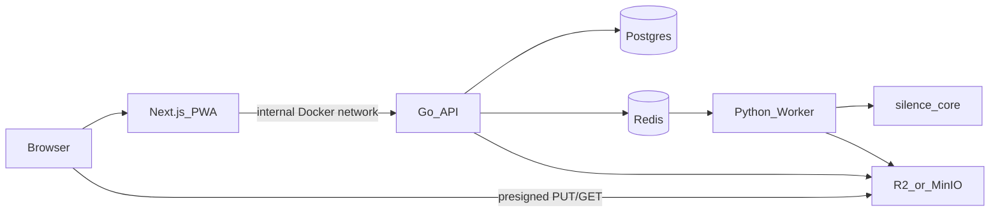

# Silence Remover by Puhulab

Local toolkit **and** free web SaaS for tightening voiceovers and short videos with [Silero VAD](https://github.com/snakers4/silero-vad) + `ffmpeg`.

**Product:** [silence-remover.puhulab.com](https://silence-remover.puhulab.com) — no account, IP rate limits, audio **and** video.



## What’s in the repo

| Path | Role |
|------|------|
| [`packages/silence_core/`](packages/silence_core/) | Importable silence-removal library |
| [`apps/cli/`](apps/cli/) | Local CLIs (`silence_remover.py`, `transcribe.py`) |
| [`apps/api/`](apps/api/) | Go REST API (jobs, rate limit, presign, queue) — **not public in MVP** |
| [`apps/worker/`](apps/worker/) | Python worker (Redis → silence_core → storage + retention cleanup) |
| [`apps/web/`](apps/web/) | Silence Remover by Puhulab UI (PWA, compare players, history) |
| [`design/`](design/) | Generative brand mark (`node design/generate-logo.mjs`) |
| [`docker-compose.yml`](docker-compose.yml) | Dokploy-ready stack (MinIO behind Compose profile) |
| [`docs/`](docs/) | Architecture, API, deploy guides |

## Documentation

| Doc | Contents |
|-----|----------|
| [docs/architecture.md](docs/architecture.md) | Monorepo layout, trust boundaries, job lifecycle |
| [docs/api.md](docs/api.md) | Internal Go `/v1` API, tokens, rate limits, queue, preview URLs |
| [docs/deploy.md](docs/deploy.md) | Dokploy + Compose, env vars, MinIO/R2, CORS, retention, PWA |

---

## Product features (web)

- **Brand:** Silence Remover by Puhulab (logo under `apps/web/public/brand/`, generated from `design/`)
- **Upload / download:** browser talks to object storage with **presigned URLs** (file bytes do not proxy through the app server)
- **Before / After:** in-page play of original vs processed; duration stats (`2:15 → 1:40 · 35s shorter`)
- **Recent files:** `localStorage` keeps job access on this device for **1 day**
- **Retention:** worker deletes stored objects after **`OBJECT_RETENTION_HOURS`** (default **24**)
- **Limits:** IP-based — default **10 jobs/day**, **2 concurrent**; max upload **200 MB** (`MAX_UPLOAD_BYTES`)
- **PWA:** Add to Home Screen (`/manifest.webmanifest`, `/icon-192`, `/icon-512`, `/sw.js`)
- **Share previews:** Open Graph / Twitter images (`opengraph-image`, `twitter-image`)
- **Legal:** [`/terms`](https://silence-remover.puhulab.com/terms) and [`/privacy`](https://silence-remover.puhulab.com/privacy)

Supported media: audio (`.mp3`, `.wav`, `.m4a`, …) and video (`.mp4`, `.mov`, `.mkv`, `.webm`, `.avi`, `.m4v`).

### Upload flow (short)

1. Browser → Next `/api/jobs` → Go creates job + presigned **PUT** URL  
2. Browser **PUT**s file directly to R2/MinIO  
3. Browser → complete-upload → Go verifies object, enqueues Redis  
4. Worker processes → writes output + durations → `completed`  
5. Browser polls status → preview/download URLs (direct GET from storage)

---

## Local CLI (silence remove)

### Requirements

- Python 3.10+
- `ffmpeg` / `ffprobe` on `PATH`
- Network on first run (Silero weights)

### Setup

```bash
python3 -m venv .venv
source .venv/bin/activate
pip install -e packages/silence_core
```

Full toolkit (includes mlx-whisper on Apple Silicon):

```bash
pip install -r requirements.txt
```

### Usage

```bash
python apps/cli/silence_remover.py voiceover.mp3 -o voiceover_nosilence.mp3
python apps/cli/silence_remover.py take.mp4 --max-silence 0.15 --speech-pad-ms 40

# Optional (macOS Apple Silicon / mlx-whisper only)
python apps/cli/transcribe.py voiceover_nosilence.mp3
```

See CLI flags via `python apps/cli/silence_remover.py -h`.

`apps/cli/transcribe.py` remains macOS / MLX-only and is **not** part of the SaaS stack.

---

## SaaS stack (Dokploy + Docker Compose)

MVP: **free**, no signup, **IP rate limits**, Go API reachable only from the web container.

### Services

- `web` — public (Dokploy domain + HTTPS); Next.js + PWA
- `api` — internal only (do **not** publish a domain)
- `worker` — internal (processing + object cleanup)
- `postgres`, `redis` — internal
- `minio` / `minio-init` — optional Compose profile `minio` (local/dev); prefer **Cloudflare R2** in production

### Configure

```bash
cp .env.example .env
# edit secrets / R2 credentials as needed
```

Important env vars:

| Variable | Purpose |
|----------|---------|
| `COMPOSE_PROFILES` | `minio` for local MinIO; empty/omit for R2 |
| `S3_ENDPOINT` | Server-side S3/R2/MinIO URL |
| `S3_PUBLIC_ENDPOINT` | Browser-facing URL for presigned PUT/GET |
| `OBJECT_RETENTION_HOURS` | Default `24` — worker deletes media after this age |
| `RATE_LIMIT_JOBS_PER_DAY` | Default `10` (per IP, UTC day) |
| `RATE_LIMIT_MAX_CONCURRENT` | Default `2` |
| `MAX_UPLOAD_BYTES` | Default `209715200` (200 MB) |
| `API_INTERNAL_URL` | Web → API (`http://api:8080`) |
| `NEXT_PUBLIC_SITE_URL` | Public HTTPS origin (Open Graph + PWA) |

### Run (local)

```bash
# Local with MinIO (.env.example sets COMPOSE_PROFILES=minio)
docker compose -f docker-compose.yml -f docker-compose.local.yml up --build
```

Open `http://localhost:3000`.

`docker-compose.local.yml` publishes host port `3000` — **do not** use it on Dokploy.

### Brand assets

```bash
node design/generate-logo.mjs --seed 20260720
# writes design/out/* and apps/web/public/brand/*
```

### Dokploy

1. Compose app from this repo — **`docker-compose.yml` only** (not `docker-compose.local.yml`).
2. Env from `.env.example` (prefer Cloudflare R2; leave `COMPOSE_PROFILES` empty).
3. Domain **only** on `web` (container port `3000`).
4. Set `NEXT_PUBLIC_SITE_URL` and R2 `S3_*` endpoints the **browser** can reach.
5. R2 bucket **CORS:** allow `GET`, `PUT`, `HEAD` from your web origin (needed for direct upload, preview, and download).

Optional R2 lifecycle (1 day) can mirror app retention — see [docs/deploy.md](docs/deploy.md).

### Go API (internal)

| Method | Path | Notes |
|--------|------|-------|
| `POST` | `/v1/jobs` | Create job + presigned upload URL |
| `POST` | `/v1/jobs/{id}/complete-upload` | Verify upload + enqueue (`X-Job-Token`) |
| `GET` | `/v1/jobs/{id}` | Status, durations, preview + download URLs (`X-Job-Token`) |
| `GET` | `/healthz` | Health |

Public API keys / external access are intentionally deferred.

---

## Project layout

```
silence-remover/
├── apps/
│   ├── api/          # Go
│   ├── cli/          # Local Python CLIs
│   ├── worker/       # Python worker + retention cleanup
│   └── web/          # Next.js PWA (Silence Remover by Puhulab)
├── packages/
│   └── silence_core/ # Shared processing library
├── design/           # Generative logo script + out/
├── docs/             # architecture, api, deploy
├── docker-compose.yml
├── docker-compose.local.yml  # local host ports only
├── .env.example
└── README.md
```

---

## Troubleshooting

| Problem | Fix |
|---------|-----|
| `ffmpeg` not found (CLI) | Install ffmpeg (`brew` / `apt`) |
| `Bind for 0.0.0.0:3000 failed` (Dokploy) | Use `docker-compose.yml` only; do not mount `docker-compose.local.yml` |
| Upload / preview / download CORS errors | R2 CORS must allow `GET`/`PUT`/`HEAD` from the web origin |
| Upload fails with MinIO | Port `9000` reachable; `S3_PUBLIC_ENDPOINT` matches browser host; profile `minio` enabled |
| Rate limit (`429`) | Wait for UTC day window, clear Redis `ratelimit:jobs:*`, or raise `RATE_LIMIT_*` |
| Same file won’t re-upload | Hard-refresh after deploy (input remount fix); or pick another file |
| WhatsApp shows wrong logo | Deploy OG routes; scrape again (cache); check `/opengraph-image` |
| `manifest.json` 404 | Expected if requesting that path — real manifest is `/manifest.webmanifest` |
| `mlx-whisper` import error | Apple Silicon + Python 3.11; not used by the SaaS worker |
| Words clipped after cut | Raise `--speech-pad-ms` on CLI |

---

## License

MIT — see [LICENSE](LICENSE).

Silero VAD, Whisper / mlx-whisper, and ffmpeg are third-party tools; respect their licenses and model terms.
