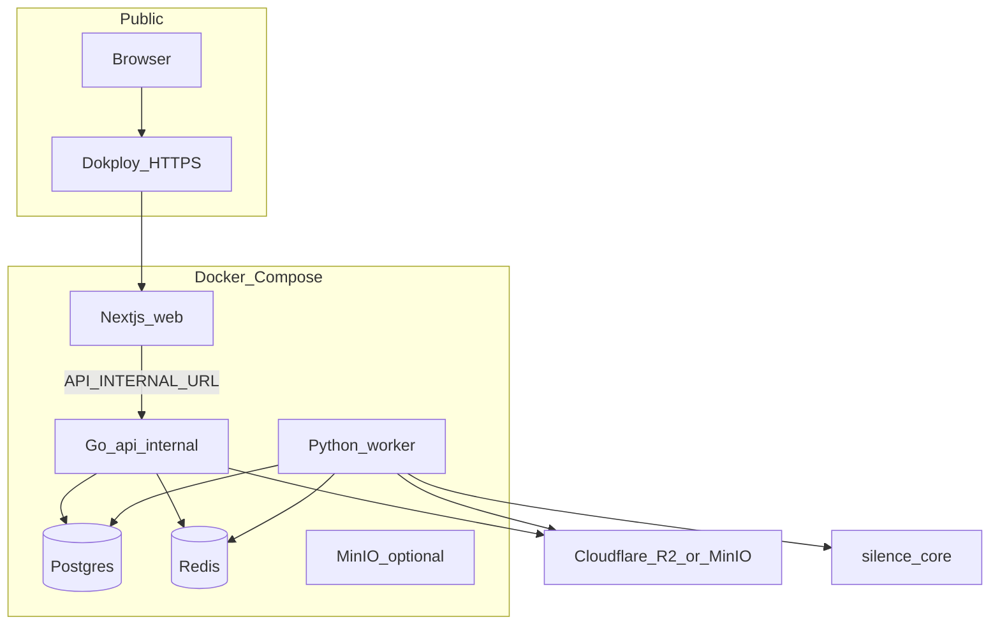
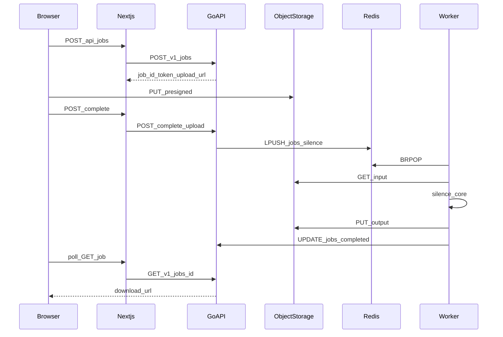

# Architecture

How the monorepo is structured and how a silence-removal job moves through the system.

## Goals (MVP)

- Free web UI (no auth, no billing)
- IP-based rate limits
- Go API is the system of record for jobs (future public API product)
- API is **not** exposed publicly in MVP — only Next.js talks to it on the Docker network
- Processing reuses [`packages/silence_core`](../packages/silence_core/) (Silero VAD + ffmpeg)

## Repository map

```
silence-remover/
├── apps/
│   ├── web/       # Next.js CutAir UI + BFF routes → Go API
│   ├── api/       # Go REST API (chi)
│   ├── worker/    # Python consumer (Redis → silence_core → object storage)
│   └── cli/       # Local CLIs (silence_remover, transcribe)
├── packages/
│   └── silence_core/   # Shared processing library + CLI entry
├── docker-compose.yml
└── docs/
```

| Layer | Language | Responsibility |
|-------|----------|----------------|
| Web | TypeScript / Next.js | Upload UX; proxies job calls to Go; never holds business rules |
| API | Go | Create job, rate limit, presign, enqueue, status |
| Worker | Python | Download input, run `silence_core`, upload output, update status |
| Core | Python | VAD + ffmpeg jump-cut (also used by local CLI) |

## Runtime topology



**Public surface:** only `web` (Dokploy domain).  
**Internal:** `api`, `worker`, `postgres`, `redis`.  
**Object storage:** MinIO in Compose for local/dev; Cloudflare R2 recommended in production.

## Job lifecycle

Statuses stored in Postgres `jobs`:

| Status | Meaning |
|--------|---------|
| `pending_upload` | Job created; waiting for browser PUT to storage |
| `queued` | Upload verified; message on Redis list `jobs:silence` |
| `processing` | Worker running silence_core |
| `completed` | Output object ready; download via presigned GET |
| `failed` | Processing or upload error; `error` column set |



## Trust boundaries

- **Job token:** opaque UUID returned at create time; required as `X-Job-Token` for complete/status. No user accounts in MVP.
- **Rate limit:** Redis daily counter + Postgres concurrent active jobs, keyed by client IP (prefer `X-Real-IP` from the edge proxy).
- **Web → API:** server-side only (`API_INTERNAL_URL`). Do not publish the `api` service in Dokploy.
- **Presigned URLs:** signed against `S3_PUBLIC_ENDPOINT` so browsers can PUT/GET; server-side Head/Get uses `S3_ENDPOINT`.

## Out of scope (for now)

- Signup / Stripe / plans
- Public API keys and external `api.` hostname
- Transcription (`apps/cli/transcribe.py` / mlx-whisper)
- Multi-worker autoscaling and GPU
- Automatic object retention cleanup (planned soft-launch hardening)
